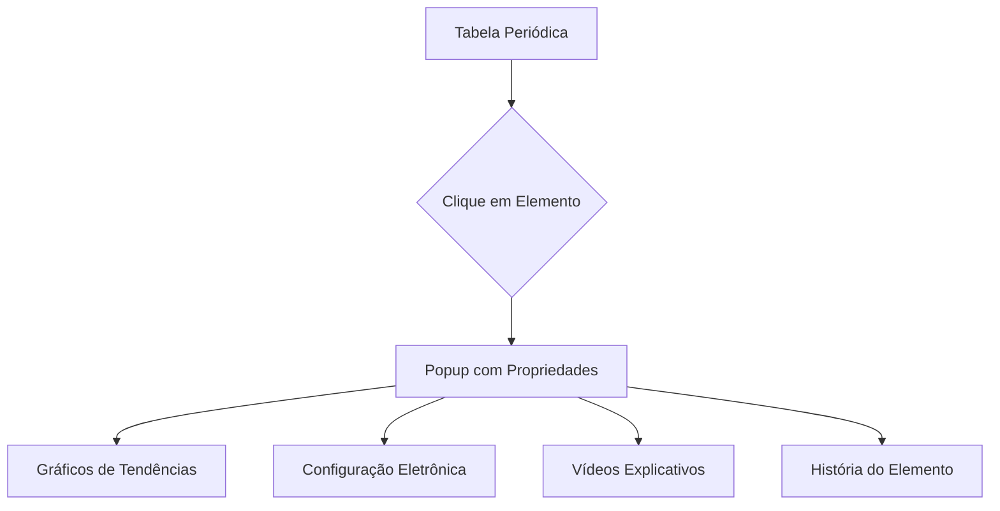
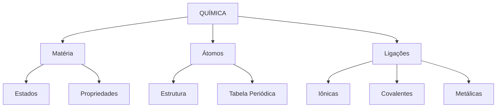
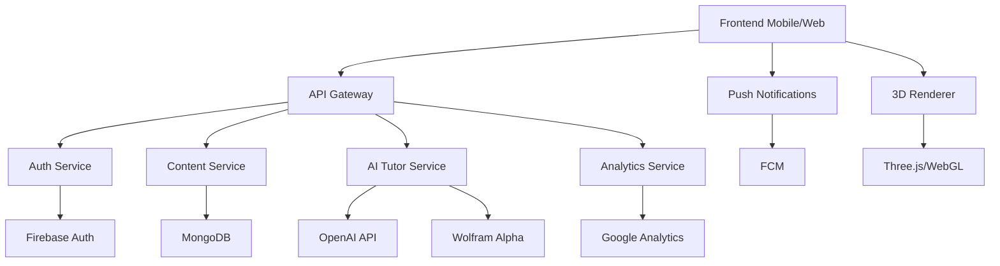

# ChemMaster - Plano de Implementação Completo

> **Tagline**: "Domine a química de forma interativa, intuitiva e divertida!"

---

## 📋 Visão Geral

**ChemMaster** é uma aplicação educacional multiplataforma focada em química geral para estudantes do ensino médio e universitários, com recursos interativos, gamificação e simulações virtuais.

### Público-Alvo
- 📚 Estudantes do ensino médio
- 🎓 Universitários (exatas/biológicas/saúde)
- 👨‍🏫 Professores de química
- 🔬 Autodidatas e entusiastas

---

## 🛠️ Stack Tecnológica

### Mobile (iOS/Android)
```
Framework: React Native ou Flutter (cross-platform)
Estado: Redux/MobX ou Provider/Riverpod
UI: React Native Paper ou Flutter Material
AR: ARCore (Android) / ARKit (iOS)
```

### Web (SPA)
```
Framework: React.js ou Vue.js
Estado: Redux/Vuex
UI: Material-UI ou Tailwind CSS
3D: Three.js / React Three Fiber
PWA: Service Workers + Manifest
```

### Backend
```
Runtime: Node.js
Framework: Express.js ou NestJS
Alternativa: Firebase (BaaS)
API: REST ou GraphQL
```

### Banco de Dados
```
Principal: MongoDB ou Firebase Firestore
Cache: Redis
Armazenamento: AWS S3 ou Firebase Storage
```

### Serviços Externos
| Serviço | Propósito |
|---------|-----------|
| ChatGPT/Gemini API | Tutor virtual com IA |
| Wolfram Alpha API | Cálculos simbólicos complexos |
| Firebase Cloud Messaging | Push notifications |
| Google Analytics / Mixpanel | Analytics e tracking |
| LaTeX renderer | Fórmulas matemáticas |

---

## 🎯 Funcionalidades Principais

### 1. Módulo de Propriedades da Matéria

#### Features
- ⚗️ **Tabela periódica 3D interativa** com seleção de elementos
- 📊 **Cards de propriedades** físicas e químicas
- 🔄 **Comparador lado a lado** com gráficos
- 🧪 **Experimentos virtuais** de mudança de estado
- ✅ **Quiz rápido** após cada tópico

#### Implementação Técnica
```javascript
// Exemplo de estrutura de dados
const Element = {
  symbol: "H",
  name: "Hidrogênio",
  atomicNumber: 1,
  atomicMass: 1.008,
  properties: {
    meltingPoint: -259.16,
    boilingPoint: -252.87,
    density: 0.0899,
    electronegativity: 2.20,
    // ...
  },
  electronConfig: "1s¹",
  group: 1,
  period: 1,
  category: "non-metal"
}
```

---

### 2. Tabela Periódica Interativa

#### Features
- 🔍 **Zoom e highlight** responsivos
- 📱 **Popup informativo** ao clicar/tocar elemento
  - Propriedades periódicas (raio atômico, eletronegatividade, EI)
  - Gráficos de tendências
  - Configuração eletrônica animada
  - Vídeos curtos (30-60s)
- 🎨 **Filtros**: metais/não-metais, grupo, estado físico
- 📅 **Linha do Tempo**: descoberta histórica

#### Visualização


#### Tecnologia UI
- **Web**: SVG interativo com D3.js
- **Mobile**: Canvas ou React Native SVG

---

### 3. Simulador de Ligações Químicas

#### Features
- 🎨 **Montagem molecular** (drag-and-drop)
- 🌐 **Visualizador 3D** de moléculas
- ⚡ **Simulação de formação**:
  - Ligações iônicas → animação de transferência de elétrons
  - Ligações covalentes → compartilhamento animado
  - Forças intermoleculares → setas de força
- 🧮 **Calculadora** de polaridade e geometria molecular

#### Stack 3D
```javascript
// Three.js / React Three Fiber
import { Canvas } from '@react-three-fiber'
import { OrbitControls, Sphere, Line } from '@react-three/drei'

function MoleculeViewer({ atoms, bonds }) {
  return (
    <Canvas>
      <OrbitControls />
      <ambientLight intensity={0.5} />
      {atoms.map(atom => (
        <Sphere key={atom.id} position={atom.position} args={[0.5]} />
      ))}
      {bonds.map(bond => (
        <Line key={bond.id} points={bond.points} />
      ))}
    </Canvas>
  )
}
```

---

### 4. Calculadora Estequiométrica

#### Features
- ⚖️ **Balanceador de equações com IA**
  - Input de equação → sugestão de balanceamento
  - Passo-a-passo animado
- 🧮 **Resolvedor de problemas**
  - Tipos: mols, massa, volume
  - Interface guiada passo-a-passo
  - Mostra cálculos intermediários
- 📉 **Simulador de reagente limitante**
  - Ajusta quantidades → gráfico de produtos
- 💾 **Banco de equações** comuns pré-cadastradas

#### Algoritmo de Balanceamento
```python
# Pseudocódigo
def balance_equation(reactants, products):
    # Método matricial usando Gaussian Elimination
    matrix = build_stoichiometry_matrix(reactants, products)
    coefficients = solve_null_space(matrix)
    return normalize_coefficients(coefficients)
```

---

### 5. Laboratório de Gases Virtual

#### Features
- 🌡️ **Simulador de leis dos gases**
  - Ajusta P, V, T, n em tempo real
  - Gráficos dinâmicos (P vs V, V vs T)
- 🔬 **Experimento**: gás ideal vs real
- 🧪 **Calculadora** de misturas gasosas (Lei de Dalton)
- 🚗 **Problemas contextuais**: pneu, balão, mergulho
- 🏆 **Modo Desafio**: condições extremas

#### Física da Simulação
```javascript
// PV = nRT (Gás Ideal)
function calculateIdealGas({ P, V, n, T, R = 0.082 }) {
  if (P === null) return (n * R * T) / V
  if (V === null) return (n * R * T) / P
  if (n === null) return (P * V) / (R * T)
  if (T === null) return (P * V) / (n * R)
}

// Van der Waals (Gás Real)
function calculateRealGas({ P, V, n, T, a, b, R = 0.082 }) {
  // (P + a(n/V)²)(V - nb) = nRT
  // Resolver numericamente
}
```

---

## 🎮 Features Especiais

### Gamificação

#### Sistema de Pontos
```javascript
const POINTS_SYSTEM = {
  quizCorrect: 10,
  quizPerfect: 50,
  dailyChallenge: 100,
  weeklyChallenge: 300,
  experimentComplete: 25,
  speedBonus: 20,  // Resolver em < 30s
  streak: 5        // Por dia consecutivo
}
```

#### Conquistas (Achievements)
- 🥉 **Iniciante**: Completar primeiro quiz
- 🥈 **Químico**: Resolver 100 problemas
- 🥇 **Mestre**: Completar todos os módulos
- 🏆 **Speedrunner**: Resolver problema em < 10s
- 🔥 **Chama**: Streak de 7 dias
- 🧪 **Cientista**: Executar 50 experimentos

#### Níveis
| Nível | XP Necessário | Título |
|-------|---------------|--------|
| 1 | 0 | Aprendiz |
| 2 | 100 | Estudante |
| 3 | 300 | Praticante |
| 5 | 1000 | Conhecedor |
| 10 | 5000 | Expert |
| 20 | 20000 | Mestre Químico |

---

### Recursos de Aprendizado

#### 🤖 Professor Virtual (IA)
```javascript
// Integração com ChatGPT/Gemini
async function askVirtualTutor(question, context) {
  const prompt = `
    Você é um professor de química experiente e paciente.
    Contexto: ${context}
    Pergunta do aluno: ${question}
    
    Explique de forma clara e didática, usando exemplos práticos.
  `
  
  const response = await openai.chat.completions.create({
    model: "gpt-4",
    messages: [{ role: "user", content: prompt }]
  })
  
  return response.choices[0].message.content
}
```

#### 📇 Flashcards Interativos
- Modo **Praticar**: revisão espaçada (Spaced Repetition)
- Modo **Desafio**: tempo limitado
- Criação personalizada

#### 🗺️ Mapas Mentais Clicáveis


#### 🎧 Resumos em Áudio
- Podcast-style para revisão durante deslocamento
- Velocidade ajustável (0.5x a 2x)
- Marcadores de tempo

#### 📝 Gerador de Provas
```javascript
function generateExam({
  topics = [],
  difficulty = 'medium',
  questionCount = 20,
  timeLimit = 60  // minutos
}) {
  const questions = selectRandomQuestions(topics, difficulty, questionCount)
  return {
    id: generateId(),
    questions,
    timeLimit,
    createdAt: Date.now()
  }
}
```

---

### 👨‍🏫 Painel do Professor

#### Features
- 📊 **Dashboard de turmas** com estatísticas
- ✏️ **Criação de listas** de exercícios personalizadas
- 📈 **Análise de dificuldades** comuns
- 📅 **Agendador** de conteúdos/aulas
- 📄 **Exportação** de relatórios (PDF, Excel)

#### Exemplo de Dashboard
```javascript
const TeacherDashboard = {
  classes: [
    {
      id: "3A",
      students: 30,
      averageScore: 7.5,
      completionRate: 85%,
      difficultTopics: ["Estequiometria", "pH"],
      topStudents: ["Ana Silva", "João Santos"],
      needsAttention: ["Pedro Costa"]
    }
  ],
  assignedHomework: 5,
  pendingGrading: 12
}
```

---

### 🤝 Social e Colaborativo

#### Features
- 👥 **Grupos de estudo** privados
- 💬 **Fórum de dúvidas** com votação
- 🔗 **Compartilhamento** de resoluções
- 🎯 **Desafios multiplayer** em tempo real
- 🎓 **Sistema de mentoria**: alunos avançados ajudam iniciantes

#### Estrutura de Grupo
```javascript
const StudyGroup = {
  id: "group_123",
  name: "Química - ENEM 2026",
  members: ["user1", "user2", "user3"],
  posts: [
    {
      author: "user1",
      content: "Alguém pode explicar eletronegatividade?",
      replies: 5,
      upvotes: 12
    }
  ],
  challenges: ["weekly_quiz_acid_base"],
  ranking: [
    { userId: "user2", points: 1200 },
    { userId: "user1", points: 950 }
  ]
}
```

---

## 🎨 Design e UX/UI

### Paleta de Cores

Inspirada em elementos químicos:

```css
:root {
  /* Cores Primárias - Metais Preciosos */
  --gold: #FFD700;
  --silver: #C0C0C0;
  --copper: #B87333;
  
  /* Cores Secundárias - Gases Nobres */
  --neon: #FF6B6B;
  --argon: #4ECDC4;
  --krypton: #45B7D1;
  --xenon: #A8E6CF;
  
  /* Neutros */
  --dark-matter: #2C3E50;
  --light-element: #ECF0F1;
  
  /* Estados */
  --solid: #3498DB;
  --liquid: #9B59B6;
  --gas: #E74C3C;
}
```

### Design System

#### Componentes Base
- **Atoms**: Button, Input, Icon, Badge
- **Molecules**: Card, SearchBar, PeriodicCell
- **Organisms**: NavigationBar, PeriodicTable, Quiz
- **Templates**: Dashboard, Lesson, Experiment
- **Pages**: Home, Learn, Practice, Profile

#### Ícones
```
Baseados em símbolos químicos:
⚛️ Átomo → Teoria Atômica
🧪 Tubo de Ensaio → Experimentos
📊 Gráfico → Estatísticas
🔬 Microscópio → Detalhes
💡 Lâmpada → Dicas
```

---

### Layout Mobile

#### Bottom Navigation
```
┌─────────────────────────────┐
│        CONTEÚDO            │
│                             │
└─────────────────────────────┘
┌───────┬───────┬───────┬─────┐
│ 🏠    │ 📚    │ 🎯   │ 👤  │
│ Início│Aprend│Prátic│Perfil│
└───────┴───────┴───────┴─────┘
```

#### Gestures
- **Swipe Left/Right**: Navegar entre lições
- **Pinch**: Zoom na tabela periódica
- **Long Press**: Detalhes rápidos
- **Pull Down**: Refresh

#### Notificações Push
```javascript
const NOTIFICATIONS = {
  dailyReminder: "⏰ Hora de praticar! Faça o desafio de hoje",
  achievement: "🏆 Parabéns! Nova conquista desbloqueada",
  streak: "🔥 Você tem um streak de 5 dias!",
  groupActivity: "👥 Novo post no seu grupo de estudo"
}
```

---

### Layout Web

#### Dashboard
```
┌────────────────────────────────────────┐
│  SIDEBAR  │      WORKSPACE            │
│           │  ┌──────────┬──────────┐  │
│  📚 Tópicos│  │  Tab 1  │  Tab 2  │  │
│  🎯 Quiz  │  └──────────┴──────────┘  │
│  🧪 Lab   │                           │
│  📊 Stats │     CONTEÚDO PRINCIPAL    │
│  👥 Social│                           │
│           │                           │
└────────────────────────────────────────┘
```

#### Features Web Exclusivas
- **Multi-abas**: Comparar conteúdos lado a lado
- **Workspace customizável**: Widgets arrastáveis
- **Atalhos de teclado**: Navegação rápida
- **Exportação**: PDF, PNG, LaTeX

---

## 🔌 Integrações e APIs

### Arquitetura de Serviços



### Endpoints Principais

#### Authentication
```http
POST   /api/auth/register
POST   /api/auth/login
POST   /api/auth/logout
GET    /api/auth/profile
```

#### Content
```http
GET    /api/elements
GET    /api/elements/:symbol
GET    /api/lessons
GET    /api/lessons/:id
POST   /api/quiz/submit
GET    /api/flashcards
```

#### AI Tutor
```http
POST   /api/tutor/ask
GET    /api/tutor/hints/:problemId
POST   /api/chemistry/balance
POST   /api/chemistry/calculate
```

#### Social
```http
GET    /api/groups
POST   /api/groups/create
GET    /api/groups/:id/posts
POST   /api/groups/:id/posts
GET    /api/leaderboard
```

---

## 📱 Progressive Web App (PWA)

### Service Worker
```javascript
// sw.js
const CACHE_NAME = 'chemmaster-v1'
const urlsToCache = [
  '/',
  '/static/css/main.css',
  '/static/js/main.js',
  '/periodic-table.json',
  '/elements-data.json'
]

self.addEventListener('install', event => {
  event.waitUntil(
    caches.open(CACHE_NAME)
      .then(cache => cache.addAll(urlsToCache))
  )
})

self.addEventListener('fetch', event => {
  event.respondWith(
    caches.match(event.request)
      .then(response => response || fetch(event.request))
  )
})
```

### Manifest
```json
{
  "name": "ChemMaster",
  "short_name": "ChemMaster",
  "description": "Aprenda química de forma interativa",
  "start_url": "/",
  "display": "standalone",
  "background_color": "#2C3E50",
  "theme_color": "#FFD700",
  "icons": [
    {
      "src": "/icon-192.png",
      "sizes": "192x192",
      "type": "image/png"
    },
    {
      "src": "/icon-512.png",
      "sizes": "512x512",
      "type": "image/png"
    }
  ]
}
```

---

## 🚀 Roadmap de Desenvolvimento

### Fase 1: MVP (3 meses)

**Objetivo**: Lançar versão básica funcional

| Semana | Entregável |
|--------|-----------|
| 1-2 | Setup de projeto, arquitetura, design system |
| 3-4 | Tabela periódica interativa básica |
| 5-6 | Sistema de autenticação e perfil |
| 7-8 | Calculadora estequiométrica simples |
| 9-10 | 50 flashcards + quiz básico |
| 11-12 | Testes, deploy, lançamento beta |

**Features MVP**:
- ✅ Tabela periódica com informações básicas
- ✅ Login/Cadastro
- ✅ Calculadora estequiométrica
- ✅ 50 flashcards
- ✅ Quiz simples (10 questões)
- ✅ Perfil de usuário
- ✅ Modo claro/escuro

---

### Fase 2: Gamificação (6 meses)

**Objetivo**: Engajamento e retenção

| Mês | Features |
|-----|----------|
| 4 | Sistema de pontos e conquistas |
| 4 | Simulador de gases com gráficos |
| 5 | Balanceador de equações com IA |
| 5 | Ranking e desafios diários |
| 6 | Conteúdo completo de propriedades da matéria |
| 6 | Mapas mentais e resumos em áudio |

**Features Fase 2**:
- ✅ Gamificação completa (XP, níveis, conquistas)
- ✅ Simulador de leis dos gases
- ✅ IA para balanceamento de equações
- ✅ 200+ questões de quiz
- ✅ Desafios diários e semanais
- ✅ Estatísticas de progresso

---

### Fase 3: Colaboração (1 ano)

**Objetivo**: Comunidade e professores

| Mês | Features |
|-----|----------|
| 7-8 | Visualizador molecular 3D (Three.js) |
| 8-9 | Modo multiplayer/desafios |
| 9-10 | Painel completo do professor |
| 10-11 | Grupos de estudo e fórum |
| 11-12 | Integração Google Classroom/Moodle |

**Features Fase 3**:
- ✅ Simulador 3D de moléculas
- ✅ Desafios multiplayer em tempo real
- ✅ Dashboard para professores
- ✅ Criação de provas personalizadas
- ✅ Grupos de estudo privados
- ✅ Sistema de mentoria

---

### Fase 4: Inovação (Futuro)

**Objetivo**: Diferenciais de mercado

**Features Planejadas**:
- 🔮 Realidade Aumentada (AR)
  - Visualizar moléculas no ambiente real
  - Scanner de fórmulas químicas
  - Experimentos AR guiados
  
- 🧪 Laboratório Virtual Completo
  - Equipamentos 3D interativos
  - Simulação de reações perigosas
  - Práticas virtuais pré-aula
  
- 🌐 Integração IoT
  - Sensores de pH, temperatura reais
  - Integração com kits de química
  - Experimentos híbridos (virtual + real)
  
- 🗺️ Comunidade Global
  - Tradução para 10+ idiomas
  - Competições internacionais
  - Professores convidados (lives)

---

## 💰 Modelo de Monetização

### Freemium

#### Plano Gratuito
- ✅ Tabela periódica completa
- ✅ 100 flashcards
- ✅ 50 questões de quiz/semana
- ✅ Calculadora básica
- ✅ Tutor IA (5 perguntas/dia)
- ❌ Com anúncios

#### Plano Premium ($9.99/mês ou $79.99/ano)
- ✅ **Tudo do gratuito +**
- ✅ Conteúdo ilimitado
- ✅ Tutor IA ilimitado
- ✅ Simuladores 3D
- ✅ Laboratório virtual completo
- ✅ Modo AR
- ✅ Sem anúncios
- ✅ Certificados de conclusão
- ✅ Estatísticas avançadas

#### Plano Professor ($29.99/mês)
- ✅ **Tudo do Premium +**
- ✅ Dashboard de turmas
- ✅ Criação de provas ilimitadas
- ✅ Relatórios detalhados
- ✅ Até 100 alunos
- ✅ Suporte prioritário

#### Licença Escolar (Contato para orçamento)
- ✅ Acesso para toda instituição
- ✅ Personalização com logo da escola
- ✅ Integração com sistemas existentes
- ✅ Treinamento para professores
- ✅ Suporte dedicado

---

### Parcerias Estratégicas

1. **Editoras**: Conteúdo complementar aos livros
2. **Universidades**: Licenciamento acadêmico
3. **Cursinhos**: Preparação ENEM/Vestibular
4. **Empresas químicas**: Conteúdo patrocinado educacional

---

## 📊 Métricas de Sucesso (KPIs)

### Engajamento
- 📈 **DAU/MAU**: Daily/Monthly Active Users
- ⏱️ **Tempo médio de sessão**: > 15 minutos
- 🔄 **Taxa de retenção D7**: > 40%
- 🔥 **Streak médio**: > 3 dias

### Aprendizado
- ✅ **Taxa de conclusão de módulos**: > 60%
- 📝 **Média de acertos em quiz**: > 70%
- 📚 **Flashcards revisados/usuário**: > 20/semana
- 🎓 **Certificados emitidos**: Acompanhar crescimento

### Receita
- 💵 **Taxa de conversão free → premium**: > 5%
- 💳 **MRR** (Monthly Recurring Revenue): Crescimento
- 👥 **Licenças escolares ativas**: Meta 100 no primeiro ano
- 📊 **LTV/CAC**: > 3:1

---

## 🔐 Segurança e Privacidade

### Medidas de Segurança
```javascript
// Autenticação JWT
const token = jwt.sign(
  { userId: user.id, role: user.role },
  process.env.JWT_SECRET,
  { expiresIn: '7d' }
)

// Criptografia de dados sensíveis
const encryptedData = crypto.encrypt(data, process.env.ENCRYPTION_KEY)

// Rate limiting
const limiter = rateLimit({
  windowMs: 15 * 60 * 1000, // 15 minutos
  max: 100 // limite de 100 requisições
})
```

### Compliance
- 🔒 **LGPD** (Lei Geral de Proteção de Dados - Brasil)
- 🔒 **COPPA** (Children's Online Privacy Protection - EUA)
- 🔒 **GDPR** (General Data Protection Regulation - Europa)

### Privacidade
- ✅ Dados de menores protegidos
- ✅ Opt-in para comunicações
- ✅ Exportação de dados do usuário
- ✅ Direito ao esquecimento
- ✅ Transparência no uso de IA

---

## 🧪 Testing Strategy

### Tipos de Teste

#### Unit Tests
```javascript
// Jest + React Testing Library
describe('StequiometryCalculator', () => {
  test('calcula mols corretamente', () => {
    const result = calculateMols({ mass: 18, molarMass: 18 })
    expect(result).toBe(1)
  })
  
  test('balancea equação simples', () => {
    const equation = 'H2 + O2 -> H2O'
    const balanced = balanceEquation(equation)
    expect(balanced).toBe('2H2 + O2 -> 2H2O')
  })
})
```

#### Integration Tests
- API endpoints
- Autenticação flow
- Pagamento flow

#### E2E Tests
```javascript
// Cypress
describe('User Journey', () => {
  it('completa primeiro quiz com sucesso', () => {
    cy.visit('/login')
    cy.login('user@test.com', 'password')
    cy.visit('/quiz/primeiro-quiz')
    cy.get('[data-testid="answer-1"]').click()
    cy.get('[data-testid="submit"]').click()
    cy.contains('Parabéns!').should('be.visible')
  })
})
```

---

## 📚 Documentação

### Para Desenvolvedores
- 📖 **API Reference**: Swagger/OpenAPI
- 🏗️ **Arquitetura**: Diagramas C4
- 💻 **Guia de Contribuição**: CONTRIBUTING.md
- 🎨 **Style Guide**: Figma Design System

### Para Usuários
- 🎓 **Tutorial interativo**: Primeiro uso
- ❓ **FAQ**: Perguntas frequentes
- 📹 **Video Tutoriais**: YouTube
- 💬 **Suporte**: Chat in-app

---

## 🌍 Internacionalização (i18n)

### Idiomas Prioritários
1. 🇧🇷 Português (Brasil)
2. 🇺🇸 Inglês
3. 🇪🇸 Espanhol

### Implementação
```javascript
// i18next
import i18n from 'i18next'

i18n.init({
  resources: {
    pt: {
      translation: {
        "welcome": "Bem-vindo ao ChemMaster!",
        "periodic_table": "Tabela Periódica"
      }
    },
    en: {
      translation: {
        "welcome": "Welcome to ChemMaster!",
        "periodic_table": "Periodic Table"
      }
    }
  },
  lng: 'pt',
  fallbackLng: 'en'
})
```

---

## 🎯 Próximos Passos Imediatos

### Para Começar o Desenvolvimento

1. **Setup inicial** (Semana 1)
   ```bash
   # Backend
   mkdir chemmaster-api && cd chemmaster-api
   npm init -y
   npm install express mongoose dotenv cors
   
   # Frontend Web
   npx create-react-app chemmaster-web
   cd chemmaster-web
   npm install @mui/material @emotion/react three
   
   # Mobile
   npx react-native init ChemMasterMobile
   ```

2. **Design System** (Semana 1-2)
   - Criar protótipos no Figma
   - Definir componentes base
   - Paleta de cores finalizada

3. **Database Schema** (Semana 2)
   ```javascript
   // MongoDB Schema Examples
   const ElementSchema = new Schema({
     symbol: String,
     name: String,
     atomicNumber: Number,
     properties: Object,
     // ...
   })
   
   const UserSchema = new Schema({
     email: String,
     password: String,
     progress: {
       xp: Number,
       level: Number,
       completedLessons: [ObjectId]
     }
   })
   ```

4. **MVP Features** (Semana 3-12)
   - Implementar features conforme planejado
   - Testes contínuos
   - Deploy em staging

---

## 📞 Contatos e Recursos

### Equipe Necessária

| Papel | Quantidade | Skills |
|-------|-----------|---------|
| Product Manager | 1 | Visão de produto, roadmap |
| UX/UI Designer | 1 | Figma, design system |
| Frontend Dev (Web) | 2 | React, Three.js |
| Frontend Dev (Mobile) | 2 | React Native/Flutter |
| Backend Dev | 2 | Node.js, MongoDB |
| QA Engineer | 1 | Testes automatizados |
| DevOps | 1 | AWS/GCP, CI/CD |

### Recursos Úteis

- 📚 **Dados Químicos**: PubChem, ChemSpider APIs
- 🎨 **Design Inspiration**: Dribbble, Behance
- 💻 **Open Source**: Periodic Table libraries
- 🧪 **Química**: Khan Academy, Periodic Videos

---

## ✅ Checklist Pré-Lançamento

### Técnico
- [ ] Setup de repositórios (Git)
- [ ] CI/CD pipeline configurado
- [ ] Testes unitários > 80% coverage
- [ ] Performance otimizada (Lighthouse > 90)
- [ ] Acessibilidade WCAG AA
- [ ] SEO otimizado

### Legal
- [ ] Termos de Uso redigidos
- [ ] Política de Privacidade
- [ ] LGPD compliance
- [ ] Registro de marca

### Marketing
- [ ] Landing page
- [ ] Redes sociais criadas
- [ ] Video demo produzido
- [ ] Press kit preparado

### Infraestrutura
- [ ] Domínio registrado
- [ ] Servidores provisionados
- [ ] CDN configurado
- [ ] Backup automático
- [ ] Monitoramento (Sentry, LogRocket)

---

**ChemMaster - Transformando o ensino de química através da tecnologia!** 🧪🚀

*Documento criado em: 30/01/2026*
*Versão: 1.0*
